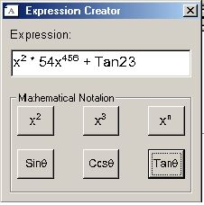



## Show superscript numbers, along with regular text \(ie x^2

### Description

Shows superscript numbers in the correct format. (see picture if you dont know what this is)

Can show any number in superscript. Ie x^857578758, there is no limit. There is also an angle symbol included. This is really useful for people writing mathematical programs

Zip includes a font file, if you dont have it then copy it to your windows fonts diectory, to make the program work correctly.

Feel free to vote
 
### More Info
 

             |
---                |---
**Submitted On**   |2000-01-21 13:08:20
**By**             |[Mike Howell](https://github.com/Planet-Source-Code/PSCIndex/blob/master/ByAuthor/mike-howell.md)
**Level**          |Advanced
**User Rating**    |5.0 (20 globes from 4 users)
**Compatibility**  |VB 5\.0, VB 6\.0
**Category**       |[Math/ Dates](https://github.com/Planet-Source-Code/PSCIndex/blob/master/ByCategory/math-dates__1-37.md)
**World**          |[Visual Basic](https://github.com/Planet-Source-Code/PSCIndex/blob/master/ByWorld/visual-basic.md)
**Archive File**   |[Show\_super15116812112002\.zip](https://github.com/Planet-Source-Code/mike-howell-show-superscript-numbers-along-with-regular-text-ie-x-2__1-41507/archive/master.zip)

